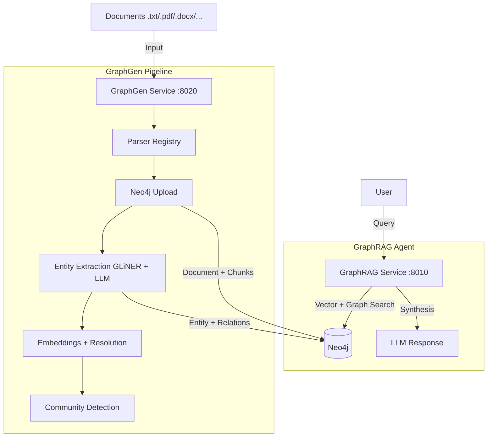
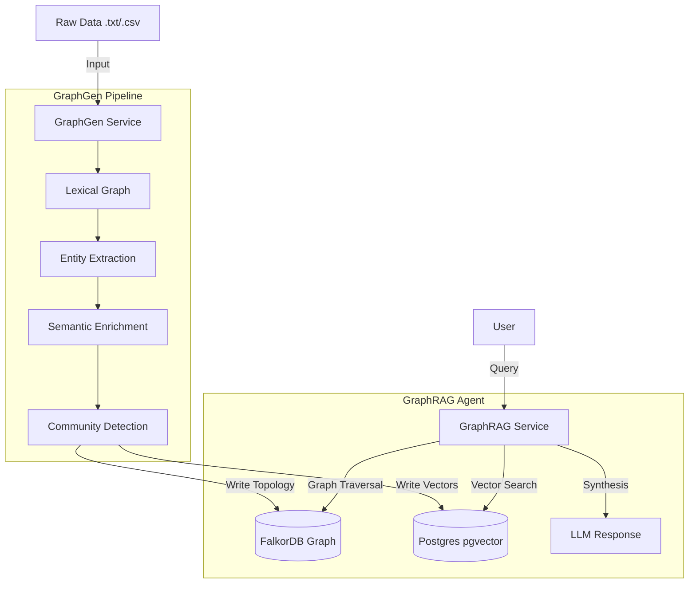

# Knowledge Graph Project

This repository implements a decoupled, agentic Knowledge Graph system designed to transform unstructured documents into a queryable semantic memory.

It consists of two primary microservices:
- **GraphGen** (Generation/ETL): A pipeline that parses documents, extracts entities using GLiNER + LLMs, resolves coreferences, detects communities, and stores everything in Neo4j.
- **GraphRAG** (Retrieval/API): An agentic retrieval system powered by **LlamaIndex** `ReActAgent` that navigates the graph to answer complex user queries.

---

## System Architecture

The system follows a strict producer-consumer model, decoupled by Neo4j as the shared storage layer.



### Shared Infrastructure
- **Neo4j**: Stores graph topology, properties, and 384-dim vector embeddings (Community Edition 5.11+).

---

## Service Details

### 1. GraphGen (The Builder)
Located in `services/graphgen`.

**Key Pipeline Stages:**
1. **Document Parsing**: Auto-discovers files in `input/` using a parser registry (TXT, MD, PDF, DOCX, PPTX, XLSX, HTML, Images via pytesseract).
2. **Neo4j Upload**: Stores `Document → [:CONTAINS] → Chunk` nodes immediately.
3. **Entity & Relation Extraction**: Uses **GLiNER** (NER) + **LLMs** (relation extraction).
4. **Semantic Enrichment**: Generates embeddings (`BAAI/bge-small-en-v1.5`), resolves duplicate entities.
5. **Community Detection**: Applies the **Leiden Algorithm** to cluster entities.
6. **Summarization**: Generates LLM-based summaries for every community.

**Key Tech**: `LangChain`, `GLiNER`, `NetworkX`, `Leidenalg`, `SentenceTransformers`, `Neo4j`.

### 2. GraphRAG (The Agent)
Located in `services/graphrag`.

**Key Tech**: `LlamaIndex ReActAgent`, `FastAPI`, `Langfuse` (Tracing), `Pydantic`, `Neo4j`.

---

## Data Schema

```
(:Document {doc_id, title, source_path, created_at})
    -[:CONTAINS]->
(:Chunk {chunk_id, text, position, doc_id, embedding[384]})
    -[:MENTIONS]->
(:Entity {entity_id, name, type, embedding[384]})
    -[:RELATED_TO {relation}]->
(:Entity)
```

---

## Getting Started

### 1. Prerequisites
- **Docker** and **Docker Compose**.
- API Keys for **Groq** (or OpenAI).

### 2. Configuration
```bash
cp .env.example .env
# Fill in: NEO4J_PASSWORD, GROQ_API_KEY
```

### 3. Run the Stack
```bash
docker-compose up --build -d
```
This starts:
- **GraphGen** (Port 8020)
- **GraphRAG** (Port 8010)
- **Neo4j** (Port 7474 / 7687)

### 4. Ingest Data
```bash
# Place files in input/
curl -X POST http://localhost:8020/run \
  -H "Content-Type: application/json" \
  -d '{"clean_database": true}'
```

Or upload individual documents:
```bash
curl -X POST http://localhost:8020/documents -F "file=@myfile.pdf"
```

### 5. Chat
- **Web UI**: [http://localhost:3333](http://localhost:3333)
- **API Docs**: [http://localhost:8010/docs](http://localhost:8010/docs)

## Development

```bash
docker-compose -f docker-compose.yaml -f docker-compose.dev.yaml up
```

---

## 🏗️ System Architecture

The system follows a strict producer-consumer model, decoupled by the storage layer.



### Shared Infrastructure
- **FalkorDB**: Stores the graph topology (Nodes, Edges, Properties).
- **PostgreSQL (pgvector)**: Stores 384-dimensional vector embeddings for hybrid retrieval.

---

## 🛠️ Service Details

### 1. GraphGen (The Builder)
Located in `services/graphgen`.

This service runs a multi-stage ETL pipeline to convert unstructured text into a structured knowledge graph.

**Key Pipeline Stages:**
1. **Lexical Construction**: Parses documents into a temporal hierarchy (`DAY` → `SEGMENT` → `EPISODE` → `CHUNK`).
2. **Entity & Relation Extraction**: Uses a hybrid of **GLiNER** (for high-precision NER) and **LLMs** (for semantic relation extraction).
3. **Semantic Enrichment**: Generates embeddings and resolves duplicate entities using vector similarity.
4. **Community Detection**: Applies the **Leiden Algorithm** to cluster entities into high-level `TOPIC` and `SUBTOPIC` nodes.
5. **Summarization**: Generates LLM-based summaries for every community and topic.
6. **Centrality**: Calculates Degree Centrality and Z-Scores for influential entities.
7. **Hybrid Upload**: Persists topology to FalkorDB and vectors to Postgres.

**Key Tech**: `LangChain`, `Spacy`, `GLiNER`, `NetworkX`, `Leidenalg`, `SentenceTransformers`.

### 2. GraphRAG (The Agent)
Located in `services/graphrag`.

This service provides a `FastAPI` interface for querying the graph. Unlike simple RAG, it uses an **Agentic Workflow** to "walk" the graph.

**Retrieval Workflow:**
1. **Keyword Extraction**: Analyzes the user query to find key entities.
2. **Seed Identification**: Uses **Hybrid Search** (Vector Similarity + Exact Match) to find entry points in the graph.
3. **Subgraph Expansion**: Expands from seeds to find relevant neighbors (Chunks, Topics, Related Entities) using Cypher queries.
4. **Context Building**: Formats the subgraph into a structured XML context for the LLM.
5. **Synthesis**: Generates a personalized answer based on the traversed path.

**Key Tech**: `LlamaIndex`, `FastAPI`, `Langfuse` (Tracing), `Pydantic`.

---

## 📊 Data Schema

The graph uses a specific schema to represent both time and knowledge:

- **Temporal Nodes**: `DAY`, `SEGMENT` (Morning/Afternoon), `EPISODE` (Events).
- **Content Nodes**: `CHUNK` (Raw text).
- **Semantic Nodes**: `ENTITY_CONCEPT` (People, Places, Concepts).
- **Organizational Nodes**: `TOPIC`, `SUBTOPIC` (Leiden communities).

---

## 🚀 Getting Started

### 1. Prerequisites
- **Docker** and **Docker Compose**.
- API Keys for **Groq** and **OpenAI**.

### 2. Configuration
1. Copy the example environment file:
   ```bash
   cp .env.example .env
   ```
2. Fill in your credentials in `.env`:
   ```env
   GROQ_API_KEY=gsk_...
   OPENAI_API_KEY=sk-...
   ```

### 3. Run the Stack
Build and start all services:
```bash
docker-compose up --build -d
```
This starts:
- **GraphGen** (Port 8020)
- **GraphRAG** (Port 8010)
- **FalkorDB** & **Postgres**

### 4. Ingest Data
1. Place text files (`.txt`, `.csv`) in the `input/` directory.
2. Trigger the pipeline via the API:
   ```bash
   curl -X POST http://localhost:8020/run \
     -H "Content-Type: application/json" \
     -d '{"clean_database": true}'
   ```
   *(Use `clean_database: false` for incremental updates)*

### 5. Chat
Access the retrieval interface:
- **Web UI**: [http://localhost:8010](http://localhost:8010)
- **API Docs**: [http://localhost:8010/docs](http://localhost:8010/docs)

## Development

To run with hot-reloading for local development:
```bash
docker-compose -f docker-compose.yaml -f docker-compose.dev.yaml up
```