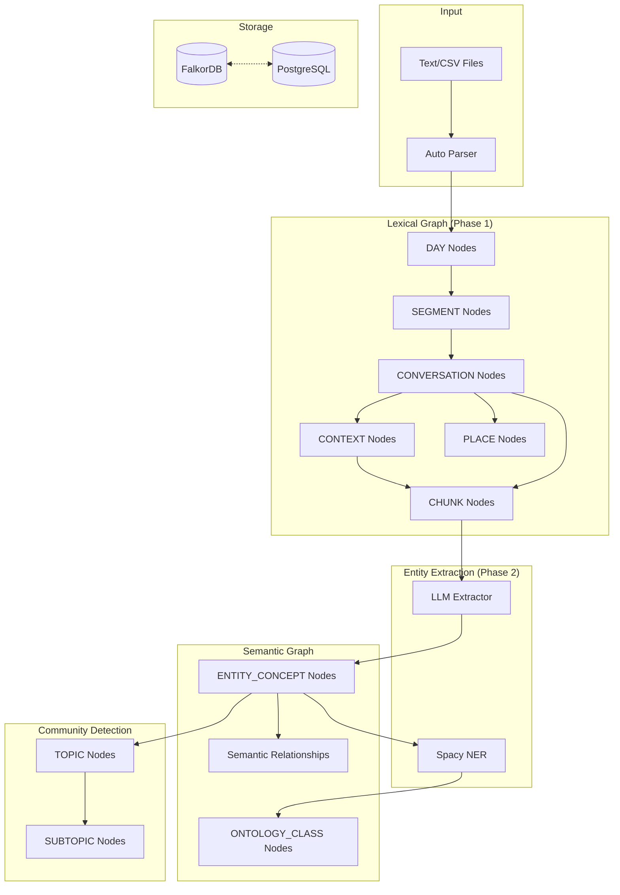

# Knowledge Graph Generation Pipeline

This module implements a comprehensive, **format-agnostic** pipeline for generating, analyzing, and storing semantic knowledge graphs from text documents. It now supports **Life Graph** episodic data with conversations, places, and visual context.

## Architecture Overview



## Key Architectural Features

- **Life Graph Support**: Native parsing of episodic data (conversations, locations, image descriptions) into a specialized graph schema
- **Ontology Layer**: Spacy NER classifies entities into `Person`, `Place`, or `Concept` categories with `IS_A` relationships to `ONTOLOGY_CLASS` nodes
- **Hybrid Storage**: Heavy embeddings (Chunks, Topics) offloaded to **PostgreSQL (pgvector)**, with FalkorDB storing graph structure and `pg_embedding_id` pointers
- **Pre-flight Health Checks**: Verifies FalkorDB and PostgreSQL connectivity before ingestion
- **Iteration Tracking**: Each run saved to timestamped directory (e.g., `output/runs/20260115_162742/`)

## Graph Schema

### Node Types

| Node Type | Description | Key Attributes |
|-----------|-------------|----------------|
| `DAY` | Date container | `name` (ISO date), `date`, `segment_count` |
| `SEGMENT` | Episode/text segment | `content`, `sentiment`, `line_number`, `global_segment_order` |
| `CONVERSATION` | Timestamped interaction | `time`, `location`, `name` |
| `CHUNK` | Processing unit (audio/text) | `text`, `pg_embedding_id`, `knowledge_triplets` |
| `PLACE` | Location node | `name` |
| `CONTEXT` | Visual/environmental context | `description` (image description) |
| `ENTITY_CONCEPT` | Extracted entity | `name`, `entity_type`, `ontology_types`, `pagerank`, `embedding` |
| `ONTOLOGY_CLASS` | Ontology type node | `name` (Person/Place/Concept) |
| `TOPIC` | Root community | `title`, `summary`, `pg_embedding_id` |
| `SUBTOPIC` | Child community | `title`, `summary`, `parent_topic` |

### Edge Types

| Edge Type | Source → Target | Description |
|-----------|----------------|-------------|
| `HAS_SEGMENT` | `DAY` → `SEGMENT` | Day contains segment |
| `HAS_CONVERSATION` | `SEGMENT` → `CONVERSATION` | Segment contains conversation |
| `HAS_CHUNK` | `CONVERSATION` / `SEGMENT` → `CHUNK` | Container has text chunk |
| `HAPPENED_AT` | `CONVERSATION` / `SEGMENT` → `PLACE` | Location link |
| `HAS_CONTEXT` | `CONVERSATION` → `CONTEXT` | Visual context |
| `HAS_DESCRIPTION_CHUNK` | `CONTEXT` → `CHUNK` | Context description text |
| `DEPICTS_PLACE` | `CONTEXT` → `PLACE` | Image shows location |
| `HAS_IMAGE_CONTEXT` | `PLACE` → `CONTEXT` | Reverse link for retrieval |
| `HAS_ENTITY` | `CHUNK` → `ENTITY_CONCEPT` | Chunk mentions entity |
| `IS_A` | `ENTITY_CONCEPT` → `ONTOLOGY_CLASS` | Ontology classification |
| `IN_TOPIC` | `ENTITY_CONCEPT` → `TOPIC` | Entity belongs to topic |
| `PARENT_TOPIC` | `SUBTOPIC` → `TOPIC` | Hierarchy link |
| *(Semantic)* | `ENTITY` → `ENTITY` | Custom relations (e.g., `SUPPORTS`, `OPPOSES`) |

### Ontology Classification

The pipeline uses Spacy NER to automatically classify extracted entities:

```python
# src/kg/graph/extraction.py
def classify_entity(name: str) -> List[str]:
    """Classify entity into ontology categories using Spacy."""
    # Rule-based: "Speaker X" → Person
    # GPE, LOC, FAC → Place
    # ORG → Concept + Place
    # EVENT → Action + Concept
    # Default → Concept
```

Resulting in `ONTOLOGY_CLASS` nodes:
- `ONTOLOGY_PERSON` — People, speakers
- `ONTOLOGY_PLACE` — Locations, geographical entities
- `ONTOLOGY_CONCEPT` — Abstract concepts, organizations
- `ONTOLOGY_ACTION` — Events, activities

## Pipeline Stages

1. **Lexical Graph Construction** — Parse files, create DAY/SEGMENT/CONVERSATION/CHUNK hierarchy
2. **Entity Extraction** — LLM extracts triplets, stored as `knowledge_triplets` on chunks
3. **Graph Enrichment** — Aggregate per segment, run coreference resolution, create entities
4. **Ontology Linking** — Classify entities with Spacy, create `ONTOLOGY_CLASS` nodes and `IS_A` edges
5. **Embedding Generation** — Generate vectors for all node types
6. **Semantic Resolution** — Identifies and merges duplicate entities (e.g., "New York" vs "New York City") using text similarity metrics (Jaro-Winkler, threshold: 0.92).
7. **Community Detection** — Leiden algorithm creates Topic/Subtopic hierarchy
8. **Summarization** — LLM generates titles/summaries for topics
9. **Database Upload** — Merge to FalkorDB with hybrid Postgres storage

## Module Structure

```
src/kg/
├── pipeline/
│   ├── iterative.py      # Main pipeline orchestrator
│   ├── core.py           # Pipeline utilities
│   └── stages.py         # Stage definitions
├── graph/
│   ├── extraction.py     # Entity/relation extraction + ontology
│   ├── extractors.py     # LLM extractor implementations
│   ├── parsers/          # File parsers (generic, CSV, etc.)
│   ├── resolution.py     # Entity resolution
│   ├── similarity.py     # Embedding similarity edges
│   └── schema.py         # Schema extraction/export
├── community/            # Leiden community detection
├── summarization/        # LLM summarization
├── embeddings/           # Embedding generation
├── falkordb/             # FalkorDB uploader
├── config/               # Pydantic configuration
└── service/              # Graph service utilities
```

## Usage

### Prerequisites

```bash
docker-compose up -d  # Start FalkorDB + PostgreSQL
```

### Configuration (`config.yaml`)

```yaml
processing:
  input_dir: "input"
  parser_type: "auto"  # auto-detects Life Graph CSV format
  chunk_size: 512

falkordb:
  host: "localhost"
  port: 6379
  upload_enabled: true

postgres:
  enabled: true
  host: "localhost"
  database: "graphknows"
```

### Run Pipeline

```bash
python src/kg_main.py                    # Full run
python src/kg_main.py --log-limit 10     # Process 10 segments only
python src/kg_main.py --reset            # Reset state and reprocess
```

## Output Structure

Each run generates a timestamped directory:
```
output/runs/20260115_162742/
├── run_summary.json      # Execution statistics
├── metadata/
│   └── schema.json       # Graph schema export
├── graphs/               # NetworkX/GraphML exports
├── analytics/            # CSV statistics
└── visualizations/       # Interactive HTML maps
```
