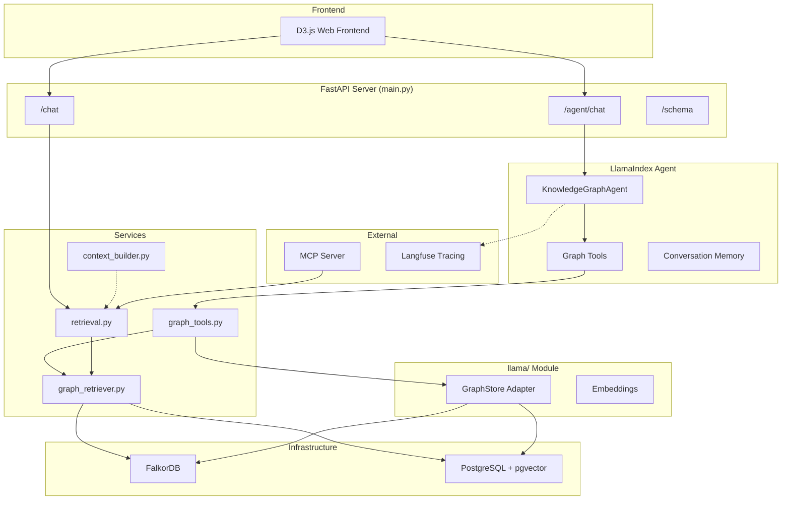

# Graph RAG Agent

A specialized agentic retrieval system powered by **LlamaIndex** that navigates knowledge graphs to answer complex queries. The agent proactively explores the graph using a suite of tools before synthesizing comprehensive answers.

## Architecture Overview



## Core Components

### 1. The Agent (`src/app/agent/`)

A **LlamaIndex FunctionAgent** that maintains conversation memory and uses tools to proactively explore the knowledge graph.

| File | Description |
|------|-------------|
| `llamaindex_agent.py` | `KnowledgeGraphAgent` class with `chat()` method, conversation memory, and singleton pattern |
| `schema.py` | Pydantic models: `ConversationContext`, `QueryResult` for state management |
| `tracing.py` | `GraphAgentEventHandler` captures reasoning steps (thoughts, tool calls) for debugging |
| `tools.py` | Legacy tool definitions (now superseded by `graph_tools.py`) |

**Agent Workflow:**
1. Analyze the query to identify relevant concepts
2. Proactively call tools to explore the graph
3. Build comprehensive context before answering
4. Return answer with accumulated graph data

### 2. Graph Tools (`src/app/services/graph_tools.py`)

Seven LlamaIndex `FunctionTool` instances for graph exploration:

| Tool | Purpose |
|------|---------|
| `search_entities` | Find entities by keywords (people, places, concepts) |
| `get_connections` | Explore entity relationships |
| `get_timeline` | Retrieve chronological events |
| `get_topics` | Overview of topic/subtopic hierarchy |
| `semantic_search` | Vector similarity search by query |
| `expand_context` | Full retrieval pipeline for comprehensive context |
| `get_entity_details` | Deep-dive on a specific entity |

### 3. Retrieval Services (`src/app/services/`)

| File | Description |
|------|-------------|
| `retrieval.py` | Full retrieval pipeline: keyword extraction, seed discovery, graph expansion, LLM response generation |
| `graph_retriever.py` | Multi-stage graph traversal: seed identification, subgraph expansion, BFS filtering, triplet enrichment |
| `context_builder.py` | Formats graph data into XML-structured LLM context (`<timeline>`, `<entities>`, `<relationships>`) |
| `graph_context.py` | Graph context utilities and helper functions |

**Retrieval Pipeline Stages:**
1. **Seed Identification** — Parallel vector + keyword search across Topic/Subtopic/Entity indices
2. **Semantic Expansion** — Fetch 1st-degree semantic relationships (`SUPPORTS`, `OPPOSES`, `PART_OF`)
3. **Content Retrieval** — Find Chunks linked via `[:HAS_ENTITY]`
4. **Hierarchy Reconstruction** — Traverse `Chunk → Segment → Day` for temporal context
5. **Triplet Enrichment** — Parse embedded knowledge triplets from Chunk nodes
6. **BFS Filtering** — Keep connected component, apply node limits

### 4. LlamaIndex Adapters (`src/app/llama/`)

| File | Description |
|------|-------------|
| `graph_store.py` | `GraphStore` class wrapping FalkorDB with convenience methods for agent tools |
| `embeddings.py` | Embedding generation utilities |
| `llm.py` | LLM configuration for LlamaIndex |

### 5. Infrastructure (`src/app/infrastructure/`)

| File | Description |
|------|-------------|
| `graph_db.py` | `FalkorDBDB` driver with hybrid hydration (FalkorDB + PostgreSQL) |
| `config.py` | Application configuration via environment variables |
| `llm.py` | LangChain/OpenAI wrapper for legacy retrieval |

### 6. Interfaces

#### Web API (`main.py`)
- `POST /chat` — Direct retrieval pipeline (set `use_agent=false`)
- `POST /agent/chat` — LlamaIndex agent mode (proactive exploration)
- `GET /schema` — Inspect graph schema
- `GET /expand/{node_id}` — Fetch node connections

#### MCP Server (`mcp/server.py`)
Exposes retrieval as Model Context Protocol tools for external clients (e.g., Claude Desktop):
- `kg_chat` — Runs focused retrieval
- `kg_schema` — Returns graph schema
- `kg_health` — Health check

#### Frontend (`frontend/`)
D3.js visualization for exploring retrieved subgraphs with node expansion and debugging panels.

## Monitoring & Tracing

- **Langfuse Integration** — Automatic instrumentation via `LlamaIndexInstrumentor`
- **Profiler Context Manager** — Timing logs for each pipeline stage:
  ```text
  [Profiler] LLM Keyword Extraction took 0.842s
  [Profiler] Parallel Seed Search took 0.150s
  [Profiler] Subgraph expansion took 0.321s
  ```
- **Reasoning Chain** — Agent returns `tool_calls` and `reasoning_chain` for debugging

## Running the Application

### Prerequisites
- Python 3.10+
- **FalkorDB** instance (populated by the ingestion pipeline)
- **PostgreSQL** with `pgvector` extension (optional, for hybrid storage)
- Environment variables:
  - `OPENAI_API_KEY` (or compatible LLM provider)
  - `FALKORDB_HOST`, `FALKORDB_PORT`, `FALKORDB_GRAPH_NAME`
  - `DATABASE_URL` (for pgvector, optional)
  - `LANGFUSE_PUBLIC_KEY`, `LANGFUSE_SECRET_KEY` (optional, for tracing)

### Start Server
```bash
uvicorn src.app.main:app --reload --host 0.0.0.0 --port 8000
```

### Access
- **Web UI**: [http://localhost:8000](http://localhost:8000)
- **API Docs**: [http://localhost:8000/docs](http://localhost:8000/docs)

### Run MCP Server
```bash
python -m src.app.mcp.server
```
